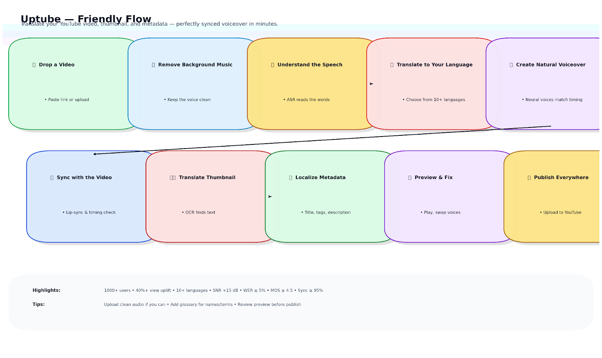
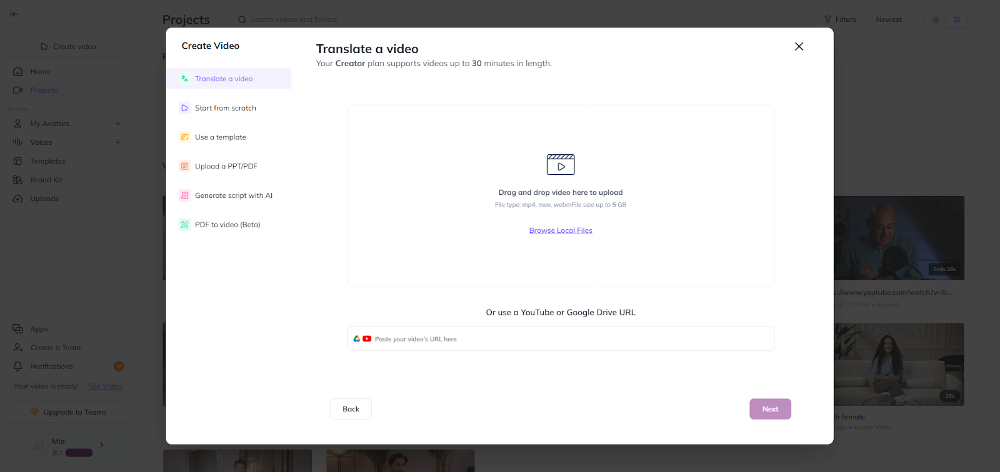
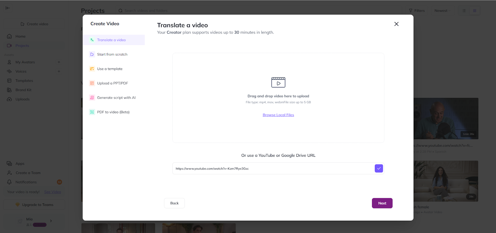
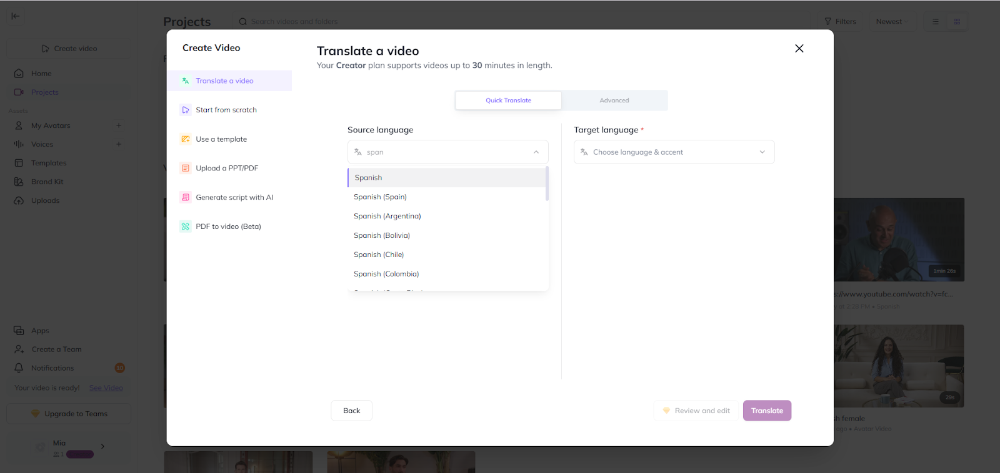
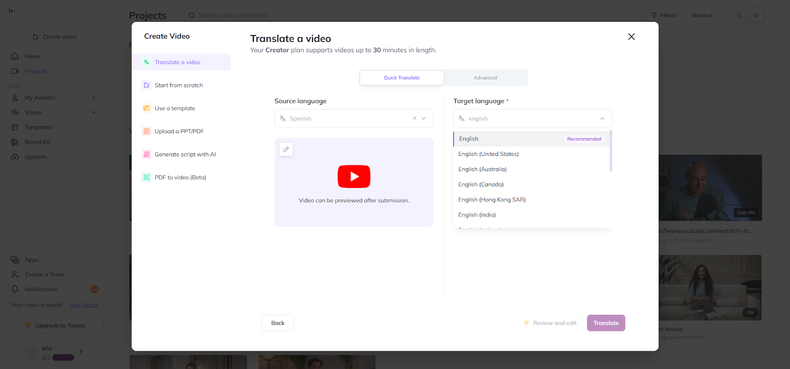
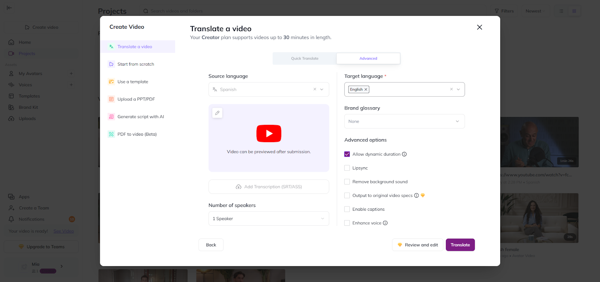
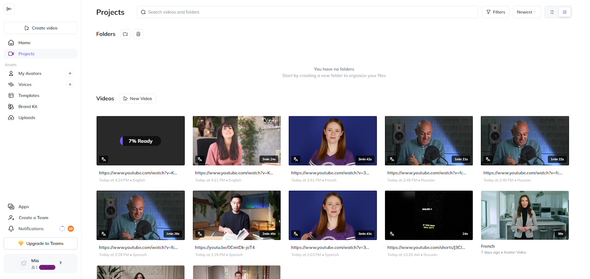

# Uptube

**Uptube** is an AI tool that helps YouTube creators share their videos with people all over the world by removing language barriers. It automatically translates not only the video’s audio but also the title, tags, description, and even the text on thumbnails.

✨ The result: viewers can watch and understand videos in their own language.

Uptube uses smart technology to remove background music, recognize speech, translate it, and then create natural-sounding voiceovers that match the original timing. Everything is synced perfectly, so the viewer experience feels smooth and natural.

With support for **10+ languages** (and more on the way), Uptube helps creators grow their audience, increase views, and reach new markets. It has already helped over **1000 users grow globally**—with some reporting **40% more views**.

Whether you're a **creator, educator, or business**, Uptube makes it easy to connect with the world through video.

---

## 📌 Scheme

1. Upload video
2. AI removes background music
3. Speech is transcribed with **ASR**
4. Content is translated into the target language
5. **TTS generates natural voiceovers**
6. Audio is synced with the video
7. Titles, tags, descriptions, and thumbnails are also translated

---

## ⚙️ Technical Description

- **Languages**: Python, SQL
- **Frameworks**: TensorFlow, PyTorch
- **Libraries**: OpenCV
- **Cloud Platforms**: AWS, GCP
- **Tools**: ChatGPT, Google Translator

## 🖼️ Examples

<table>
    <tbody>
        <tr>
            <td></td>
            <td></td>
        </tr>
        <tr>
            <td></td>
            <td></td>
        </tr>
        <tr>
            <td></td>
            <td></td>
        </tr>
    </tbody>
</table>

---

## 🎥 Video Examples

<table>
    <tbody>
        <tr>
            <td>
                <video src="https://github.com/user-attachments/assets/dd6525e9-d280-4452-9b75-76b1892794f5" controls preload>
                    Your browser does not support the video tag.
                </video>
            </td>
            <td></td>
        </tr>
    </tbody>
</table>

<table>
    <tbody>
        <tr>
            <td>
                <video src="https://github.com/user-attachments/assets/92503a07-59a6-4ad7-9893-c674eeb5ceb1" controls preload>
                    Your browser does not support the video tag.
                </video>
            </td>
            <td>
                <video src="https://github.com/user-attachments/assets/9b766c85-62fc-4e4e-b6a2-0b78b7214021" controls preload>
                    Your browser does not support the video tag.
                </video>
            </td>
        </tr>
        <tr>
            <td>
                <video src="https://github.com/user-attachments/assets/00159fb1-115a-4e0b-8855-9decb7e6d53f" controls preload>
                    Your browser does not support the video tag.
                </video>
            </td>
            <td></td>
        </tr>
    </tbody>
</table>

<table>
    <tbody>
        <tr>
            <td>
                <video src="https://github.com/user-attachments/assets/3b501e4a-06e5-4f34-a513-6d2718365c71" controls preload>
                    Your browser does not support the video tag.
                </video>
            </td>
            <td>
                <video src="https://github.com/user-attachments/assets/0df4f413-1fc9-416a-bf51-43ecd4a16048" controls preload>
                    Your browser does not support the video tag.
                </video>
            </td>
        </tr>
        <tr>
            <td>
                <video src="https://github.com/user-attachments/assets/a49344ec-ba1a-48d5-aa2c-ec710cb33884" controls preload>
                    Your browser does not support the video tag.
                </video>
            </td>
            <td></td>
        </tr>
    </tbody>
</table>

<table>
    <tbody>
        <tr>
            <td>
                <video src="https://github.com/user-attachments/assets/b602341e-68cc-40ca-bed8-4b8d568140b2" controls preload>
                    Your browser does not support the video tag.
                </video>
            </td>
            <td>
                <video src="https://github.com/user-attachments/assets/74e6367f-e2c1-426e-84f5-a2e153923d25" controls preload>
                    Your browser does not support the video tag.
                </video>
            </td>
        </tr>
        <tr>
            <td>
                <video src="https://github.com/user-attachments/assets/ca48529d-fb63-4c13-88a1-5d83bd9ac18f" controls preload>
                    Your browser does not support the video tag.
                </video>
            </td>
            <td>
                <video src="https://github.com/user-attachments/assets/83583724-c04d-44e4-94dc-d25422edad05" controls preload>
                    Your browser does not support the video tag.
                </video>
            </td>
        </tr>
        <tr>
            <td>
                <video src="https://github.com/user-attachments/assets/50afe497-55b6-47b2-94ad-ba6b9f81927d" controls preload>
                    Your browser does not support the video tag.
                </video>
            </td>
            <td>
                <video src="https://github.com/user-attachments/assets/02ade966-b030-4df6-b960-24fbbdb447d1" controls preload>
                    Your browser does not support the video tag.
                </video>
            </td>
        </tr>
    </tbody>
</table>

---

## 📖 Full Description

Uptube is an AI-powered tool designed to break down language barriers and connect content creators and viewers worldwide. It revolutionizes the YouTube experience by seamlessly translating videos and their accompanying metadata, such as titles, tags, descriptions, and thumbnails.

This comprehensive approach eliminates language barriers, allowing content creators to tap into foreign-language markets and unlock new revenue streams—while providing viewers with access to a wide range of content in their native language.

### Process

- **Preprocessing** → Audio cleanup, background music removal
- **ASR (Automatic Speech Recognition)** → Transcribes spoken words
- **Translation** → Transformer-based neural models
- **TTS (Text-to-Speech)** → Natural and expressive AI-generated voices
- **Audio-Video Synchronization** → Syncs translated speech with the original timing
- **Thumbnail Translation** → OCR + AI translation for text on images

---

## 📊 Evaluation Metrics

- **Background Music Removal** → +15 dB SNR improvement
- **ASR Accuracy** → <5% Word Error Rate
- **Translation Quality** → BLEU score > 0.9
- **TTS Quality** → MOS > 4.5 (naturalness and clarity)
- **Synchronization Precision** → 95%+ sync accuracy

---

## 🏆 Achievements

- **High Accuracy** → 90%+ precise translations
- **10+ Languages Supported** → Expanding constantly
- **1000+ Users** worldwide
- **40%+ Increase in Views** for many creators

---

## 🚀 Future Scope

- Even higher translation fluency (idioms, cultural nuances)
- **Multimodal translation** (subtitles, on-screen text, visual elements)
- More supported languages
- **Real-time dubbing** for live streams

---

## 📚 References

- Stanford CS231n: *Convolutional Neural Networks for Visual Recognition*
- Michael Nielsen, *Neural Networks and Deep Learning* (2013)
- Christopher Olah, *Understanding LSTM Networks* (2015)
- Andrew Ng, *Sequence Models* (Coursera)
- Wang et al., *Tacotron: Towards End-to-End Speech Synthesis* (2017)
- Ian Goodfellow et al., *Deep Learning*
- Arık et al., *Transfer Learning from Speaker Verification to Multispeaker TTS* (2018)
- Ping et al., *Deep Voice 3*

